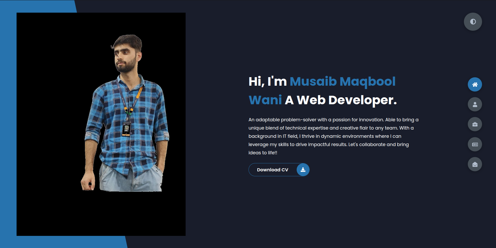
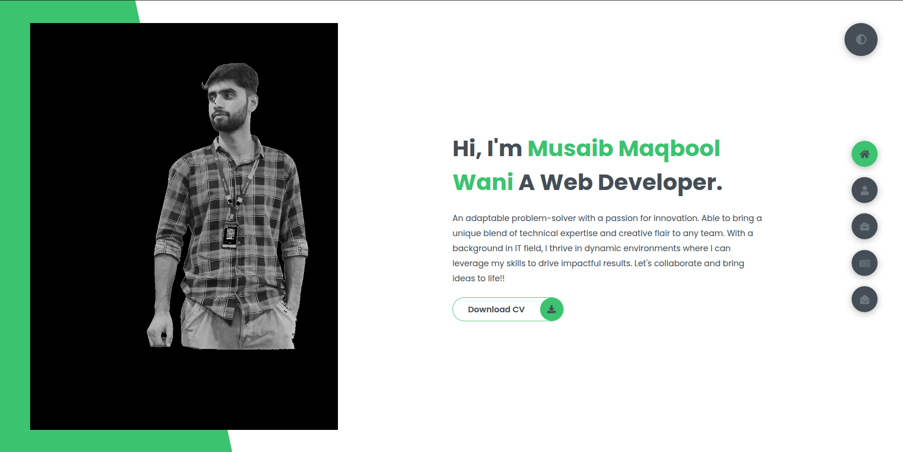

# 🌐 Portfolio Website

Welcome to my personal portfolio website! This site is designed to showcase my **projects**, **achievements**, **testimonials**, and more. Built using **HTML**, **CSS**, and **JavaScript**, it offers a responsive and user-friendly experience across all devices.

---

## 📸 Image Previews

Take a quick look at some screenshots of the portfolio:

  
  

---

## 🔗 Visit the Website

👉 [Click here to view my live portfolio](https://musaib03.github.io/M-Portfolio/)

---

## 🛠️ Key Features

- **About Me**: Learn more about who I am and my professional background.
- **Projects**: Explore my work, with detailed descriptions and links to GitHub repositories or live demos.
- **Testimonials**: Read feedback and appreciation from mentors and collaborators.
- **Contact Form**: Easily reach out to me via a built-in form integrated with WhatsApp for quick communication.
- **Responsive Design**: Optimized layout for mobile, tablet, and desktop screens.

---

## 🚀 Tech Stack

- **HTML5** – Markup and semantic structure  
- **CSS3** – Styling and layout  
- **JavaScript** – Interactive functionality

---

**Created by:**  
**Musaib Maqbool Wani**
